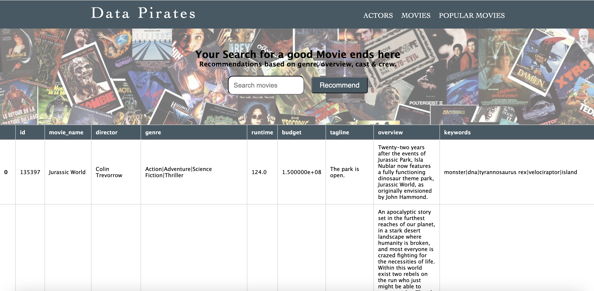
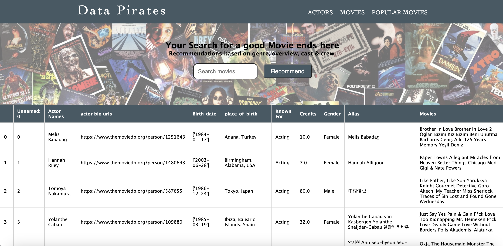
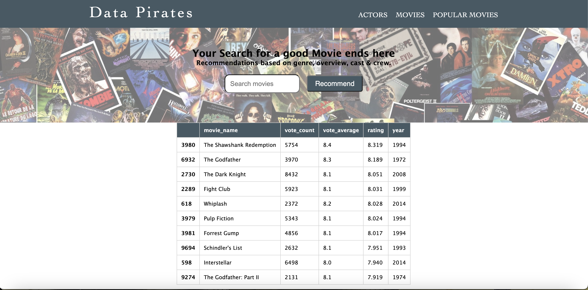

# Movie Recommendation Flask Application

This Flask application provides a movie recommendation system based on collaborative filtering. It includes features such as browsing movies, actors, and popular movies, as well as searching for movies and getting recommendations based on user preferences. The application is built using Python and the Flask framework.

## Requirements

Before running the application, make sure you have the following installed on your system:

- Python (version 3.9 ---> 3.6 is ok)
- Anaconda (to create and activate virtual environment)
- Jupyter Notebook (for data preprocessing and visualization)

## Setup

Follow the steps below to set up and run the application:

1. Open the terminal.
2. Create a virtual environment using conda with the following commands:

   ```shell
   conda create -n <envname> python=3.9 anaconda
   conda activate <envname>
   ```

   Replace `<envname>` with the desired name for your virtual environment.

3. Place the `templates`, `static`, `test.py`, `final.csv`, `actor1.xlxs`, `tmdb_movies_data.csv`, and `requirements.txt` files in the virtual environment directory.

4. Install the required Python modules by running the following command:

   ```shell
   pip install -r requirements.txt
   ```

   Make sure the `requirements.txt` file is present in the virtual environment folder.

5. Run the Flask application using the following command:

   ```shell
   python test.py
   ```

6. Open a web browser and enter the following URL to access the home page of the website:

   ```
   http://127.0.0.1:4998/
   ```

   From there, you can navigate to different sections of the website, such as movies, actors, and popular movies, using the following URLs:
Thbe movies and actors are scraped from IMDB website using web scraping `Beautiful Soup` Library
   - Movies: `http://127.0.0.1:4998/movies`

   


   - Actors: `http://127.0.0.1:4998/actors`


   


   Popular movies are movies with the highest rating

      - Popular Movies: `http://127.0.0.1:4998/highest`

   

8. To search for a movie, enter its name in the search box. The application will recommend similar movies if the movie is in the database. If the movie is not found, a message indicating that the movie is not in the database will be displayed.

   Example movie titles to try:

   - The Godfather
   - Avengers: Age of Ultron

  Movies recommended for Movie `Made`
  
   - 

## Jupyter Notebook

To explore the data preprocessing, visualization, and collaborative filtering parts of the application, follow these steps:

1. In the terminal, run the command `jupyter notebook`.
2. Open the Jupyter Notebook file included with the application.
3. Run all cells in the notebook to see how the data preprocessing and visualization are done.
4. Experiment with the collaborative filtering by changing the `uid` (user ID) to see recommendations for different users.

## References

- [Movie Recommendation Engine with NLP](https://www.analyticsvidhya.com/blog/2022/01/movie-recommendation-engine-with-nlp/)
- [Investigating TMDB 10,000 Movies Dataset](https://www.kaggle.com/code/alaanabil98/investigate-tmdb-10000-movies-dataset/notebook)
- [How to Recommend Anything: Deep Recommender](https://www.kaggle.com/code/morrisb/how-to-recommend-anything-deep-recommender)
- [How to Build a Movie Recommendation System](https://towardsdatascience.com/how-to-build-a-movie-recommendation
